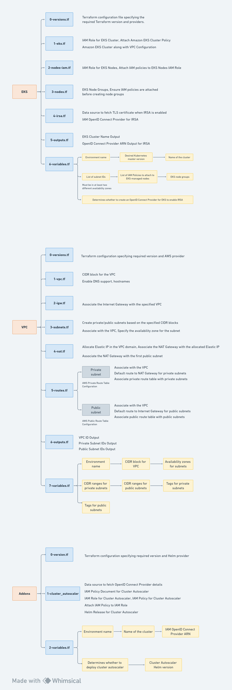

# Building EKS Cluster Using Terragrunt! (Step-by-Step)

## Project Overview

1. **Infrastructure:** The project uses Terragrunt for provisioning an Amazon EKS cluster on AWS.
   
2. **Application Management:** Helm is employed for deploying and managing Kubernetes applications within the EKS cluster.

3. **Demo Configuration:** The 'demo' directory includes configurations for a sample Nginx deployment in the EKS cluster.

## Understand  a High level Overview through a Diagram 

